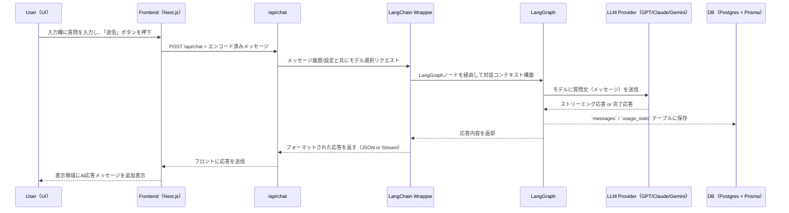
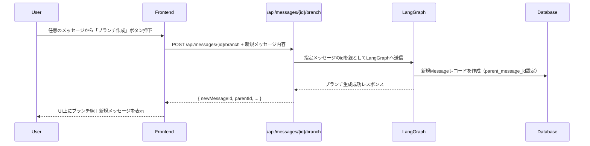
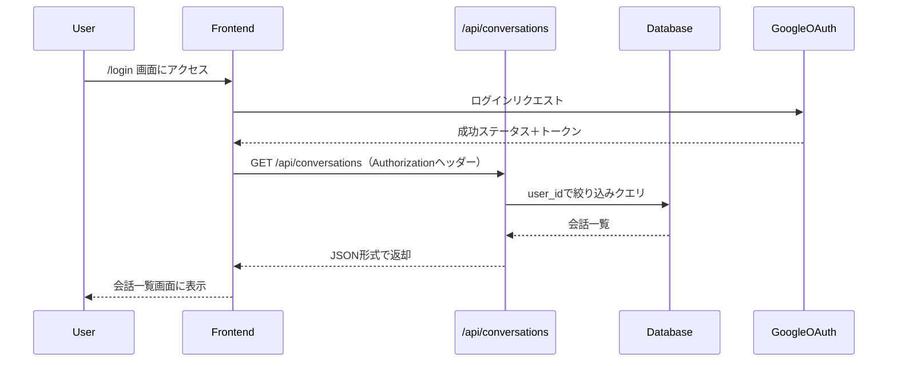
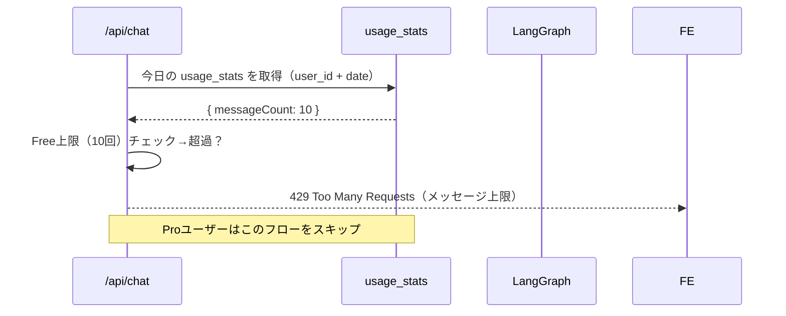

---
# フロー仕様書（Branches: MVP版）

本ドキュメントでは、Branchesにおける主要機能のシーケンスフロー（処理の流れ）を定義します。  
サーバー／クライアント／LLM間の処理がどのように進むかを明確にします。

---

## 📩 1. チャット送信 → 応答生成フロー

---

## 🌿 2. ブランチ作成フロー（既存メッセージから分岐）

---

## 🧭 3. 初回ログイン→会話取得フロー

---

## 🔐 4. Freeプランの利用制限チェックフロー

---

## 📝 備考

- 本フローはMVP時点での主要処理に着目しています  
- 実装時には `LangGraph` のワークフローノード設計とクライアント側の`UI状態管理`（React / Zustand など）を考慮してください
- 今後、以下の拡張フローを追加予定：
  - モデル切り替え設定フロー
  - Stripeなどの決済処理フロー
  - 共有（Shareableリンク）生成フロー

---

以上。