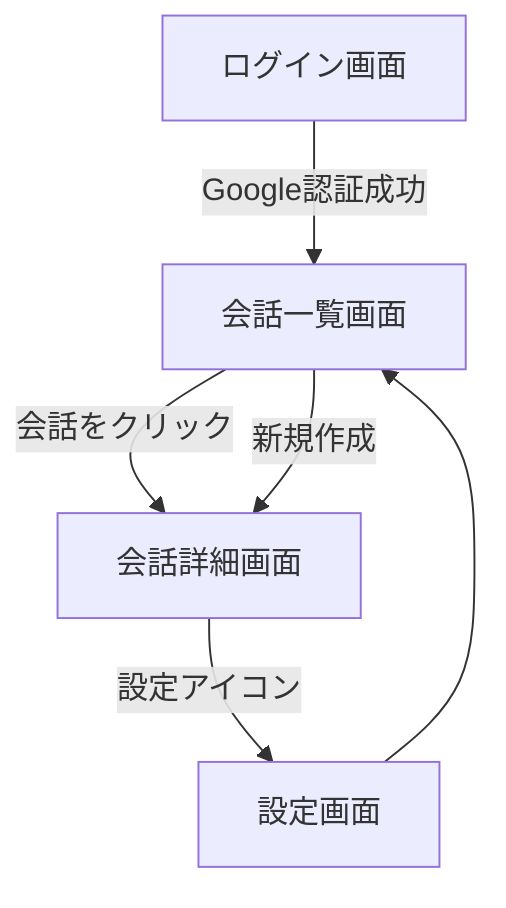

# 画面遷移仕様書（Branches: MVP版）

本ドキュメントはBranchesプロダクトにおける**画面遷移（UIフロー）**を定義します。  
MVP段階で必要な画面間の遷移パターンを明確化します。

---

## 🚦 画面遷移マップ（概要）

---

## 🧭 各画面と遷移詳細

### 1. `/login` ログイン画面

- Google OAuthボタンを押下 → 認証成功後 `/conversations` へ遷移
- 初回ログインの場合、自動的にユーザー登録される（別画面なし）

---

### 2. `/conversations` 会話一覧画面

| 遷移条件         | 遷移先                       |
|------------------|------------------------------|
| 会話項目をクリック | `/conversations/[id]`        |
| 「新しい会話」ボタン | `/conversations/[new]`（内部的に新規作成 → `[id]` へ遷移）|
| 設定アイコンクリック | `/settings`                  |

---

### 3. `/conversations/[id]` 会話詳細画面

| 遷移条件              | 遷移先               |
|-----------------------|----------------------|
| 設定アイコンを押下    | `/settings`          |
| ブランチから新会話作成 | （内部的に更新・同一画面内）|

- 入力フォームで送信 → メッセージが追加される（遷移なし）

---

### 4. `/settings` 設定画面

| 遷移条件          | 遷移先                      |
|-------------------|-----------------------------|
| 「戻る」リンク or ロゴクリック | `/conversations` |
| モデル変更         | （保存後）stay on page      |

---

## 📝 備考

- MVPフェーズではオンボーディング画面はなし
- `/login` と `/conversations` 間の認証判定はNext.js API / Middlewareで行う
- ブランチ機能は画面遷移を伴わず、同一画面内でDOM更新する

---

以上が現在のUIフロー仕様です。