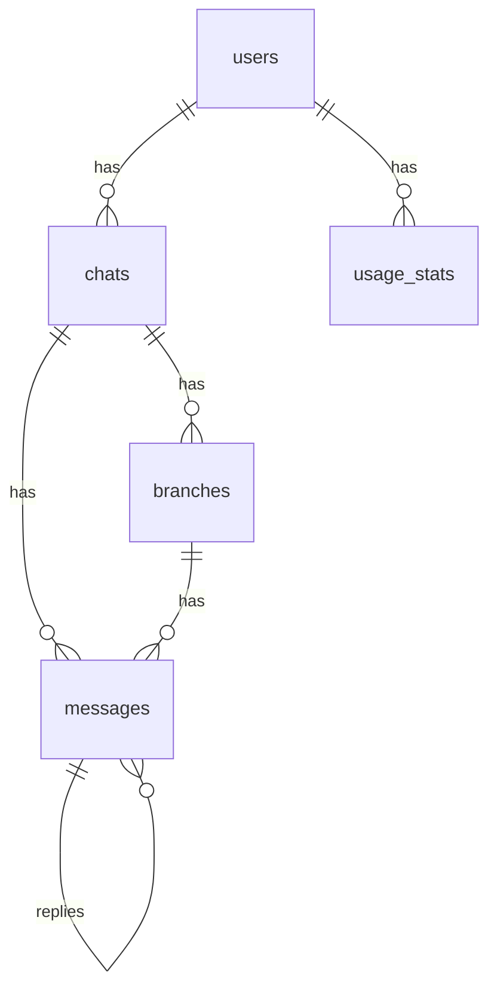

# データモデル仕様書（Branch: MVP 版）

Branch プロジェクトにおけるデータモデル（DB スキーマ）の仕様を定義します。
MVP では以下のテーブルを対象とします。

-   `users`
-   `chats`
-   `messages`
-   `branches`
-   `usage_stats`

将来的に `model_configs` や `subscriptions` などを追加する余地を残した設計とします。

---

## 1. ER 図（概要）

※ 実際の実装は PostgreSQL + Prisma を想定



---

## 2. テーブル定義

### 2.1 `users` テーブル

Branch のユーザー（Google OAuth によるアカウント）を管理します。

| カラム名               | 型          | NOT NULL | デフォルト          | 説明                                   |
| ---------------------- | ----------- | -------- | ------------------- | -------------------------------------- |
| id                     | uuid        | YES      | `gen_random_uuid()` | 主キー                                 |
| email                  | text        | YES      |                     | メールアドレス（ユニーク）             |
| name                   | text        | NO       |                     | 表示名                                 |
| image_url              | text        | NO       |                     | アイコン画像 URL                       |
| plan_type              | text        | YES      | `'free'`            | プラン種別：`'free'` / `'pro'`         |
| stripe_customer_id     | text        | NO       |                     | Stripe 顧客 ID（Pro で使用予定）       |
| stripe_subscription_id | text        | NO       |                     | Stripe サブスクリプション ID（将来用） |
| created_at             | timestamptz | YES      | `now()`             | 作成日時                               |
| updated_at             | timestamptz | YES      | `now()`             | 更新日時                               |

制約:

-   `email` はユニーク制約
-   `plan_type` はアプリケーション側で `'free' | 'pro'` のみに制御

---

### 2.2 `chats` テーブル

1 つの「木（会話ツリー）」を表します。
ユーザーごとに複数の会話が紐づきます。

| カラム名        | 型          | NOT NULL | デフォルト          | 説明                                           |
| --------------- | ----------- | -------- | ------------------- | ---------------------------------------------- |
| id              | uuid        | YES      | `gen_random_uuid()` | 主キー                                         |
| user_id         | uuid        | YES      |                     | `users.id` への外部キー                        |
| title           | text        | NO       |                     | 会話のタイトル（自動要約またはユーザー編集可） |
| language_code   | text        | NO       |                     | 会話の主な言語コード（例: 'ja', 'en'）         |
| root_message_id | uuid        | NO       |                     | ルートメッセージ ID（最初のメッセージ）        |
| is_archived     | boolean     | YES      | `false`             | アーカイブフラグ                               |
| created_at      | timestamptz | YES      | `now()`             | 作成日時                                       |
| updated_at      | timestamptz | YES      | `now()`             | 更新日時                                       |

制約:

-   `user_id` は `users(id)` を参照
-   `root_message_id` は `messages(id)` を参照（nullable）

---

### 2.3 `branches` テーブル

ブランチ（枝）を管理します。

| カラム名          | 型          | NOT NULL | デフォルト          | 説明                                           |
| ----------------- | ----------- | -------- | ------------------- | ---------------------------------------------- |
| id                | uuid        | YES      | `gen_random_uuid()` | 主キー                                         |
| chat_id           | uuid        | YES      |                     | `chats.id` への外部キー                        |
| parent_message_id | uuid        | YES      |                     | 分岐元メッセージ ID                             |
| side              | text        | YES      |                     | 表示位置（例: 'left' / 'right'）               |
| created_at        | timestamptz | YES      | `now()`             | 作成日時                                       |
| updated_at        | timestamptz | YES      | `now()`             | 更新日時                                       |

制約:

-   `chat_id` は `chats(id)` を参照
-   `parent_message_id` は `messages(id)` を参照

---

### 2.4 `messages` テーブル

会話の各メッセージ（ユーザー発話・AI 応答・システムメッセージ）を表します。
`parent_message_id` によってツリー構造（ブランチ）を表現します。

| カラム名          | 型          | NOT NULL | デフォルト          | 説明                                                   |
| ----------------- | ----------- | -------- | ------------------- | ------------------------------------------------------ |
| id                | uuid        | YES      | `gen_random_uuid()` | 主キー                                                 |
| chat_id           | uuid        | YES      |                     | `chats.id` への外部キー                                |
| parent_message_id | uuid        | NO       |                     | 親メッセージ ID（ルートメッセージの場合は NULL）       |
| branch_id         | uuid        | NO       |                     | `branches.id` への外部キー                             |
| role              | text        | YES      |                     | `'user'` / `'assistant'` / `'system'`                  |
| content           | text        | YES      |                     | メッセージ本文（MVP では text として保持）             |
| model_provider    | text        | NO       |                     | 使用したモデルプロバイダ（例: 'openai', 'anthropic'）  |
| model_name        | text        | NO       |                     | モデル名（例: 'gpt-5.2-chat-latest'）                  |
| auto_title        | text        | NO       |                     | このメッセージ以下を表すタイトル（折りたたみ時に使用） |
| is_collapsed      | boolean     | YES      | `false`             | 折りたたみ状態フラグ                                   |
| request_id        | text        | NO       |                     | 冪等性キー（ユニーク）                                 |
| created_at        | timestamptz | YES      | `now()`             | 作成日時                                               |
| updated_at        | timestamptz | YES      | `now()`             | 更新日時                                               |

制約:

-   `chat_id` は `chats(id)` を参照
-   `parent_message_id` は `messages(id)` を参照（nullable）
-   `branch_id` は `branches(id)` を参照（nullable）
-   `role` はアプリケーション側で `'user' | 'assistant' | 'system'` に制限
-   `request_id` はユニーク制約

---

### 2.5 `usage_stats` テーブル

Free プランのメッセージ上限（例: 1 日 10 メッセージ）を管理するための利用状況テーブルです。

| カラム名      | 型          | NOT NULL | デフォルト          | 説明                          |
| ------------- | ----------- | -------- | ------------------- | ----------------------------- |
| id            | uuid        | YES      | `gen_random_uuid()` | 主キー                        |
| user_id       | uuid        | YES      |                     | `users.id` への外部キー       |
| date          | date        | YES      |                     | 日付（JST 基準での 1 日単位） |
| message_count | integer     | YES      | `0`                 | 当日送信されたメッセージ数    |
| created_at    | timestamptz | YES      | `now()`             | 作成日時                      |
| updated_at    | timestamptz | YES      | `now()`             | 更新日時                      |

制約:

-   `user_id` は `users(id)` を参照
-   `(user_id, date)` にユニーク制約を付与し、1 ユーザー 1 日 1 レコードにする

---

## 3. Prisma スキーマ案（参考）

実装時に `schema.prisma` に近いイメージとして、参考用の定義を記載します。

```prisma
model User {
  id                    String   @id @default(uuid())
  email                 String   @unique
  name                  String?
  imageUrl              String?
  planType              String   @default("free")
  stripeCustomerId      String?
  stripeSubscriptionId  String?
  createdAt             DateTime @default(now())
  updatedAt             DateTime @updatedAt

  chats        Chat[]
  usageStats   UsageStat[]
}

model Chat {
  id            String    @id @default(uuid())
  userId        String
  title         String?
  languageCode  String?
  rootMessageId String?
  isArchived    Boolean   @default(false)
  createdAt     DateTime  @default(now())
  updatedAt     DateTime  @updatedAt

  user     User      @relation(fields: [userId], references: [id])
  messages Message[]
  branches Branch[]
}

model Branch {
  id              String   @id @default(uuid())
  chatId          String
  parentMessageId String
  side            String
  createdAt       DateTime @default(now())
  updatedAt       DateTime @updatedAt

  chat     Chat     @relation(fields: [chatId], references: [id])
  messages Message[]
}

model Message {
  id               String    @id @default(uuid())
  chatId           String
  parentMessageId  String?
  branchId         String?
  role             String
  content          String
  modelProvider    String?
  modelName        String?
  autoTitle        String?
  isCollapsed      Boolean   @default(false)
  requestId        String?   @unique
  createdAt        DateTime  @default(now())
  updatedAt        DateTime  @updatedAt

  chat       Chat      @relation(fields: [chatId], references: [id])
  parent     Message?  @relation("MessageToMessage", fields: [parentMessageId], references: [id])
  children   Message[] @relation("MessageToMessage")
  branch     Branch?   @relation(fields: [branchId], references: [id])
}

model UsageStat {
  id            String   @id @default(uuid())
  userId        String
  date          DateTime
  messageCount  Int      @default(0)
  createdAt     DateTime @default(now())
  updatedAt     DateTime @updatedAt

  user User @relation(fields: [userId], references: [id])

  @@unique([userId, date])
}
```

---

以上が Branch MVP 版のデータモデル仕様です。
今後、Pro プランやモデル設定、共有機能などの拡張に応じてテーブル追加を検討します。
