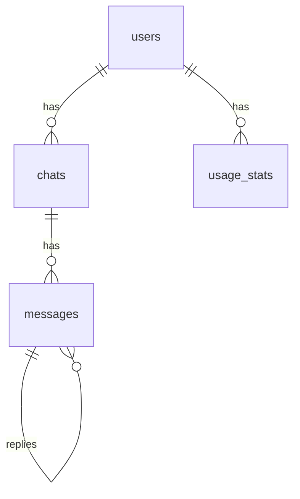

# データモデル仕様書（Branches: MVP版）

Branches プロジェクトにおけるデータモデル（DBスキーマ）の仕様を定義します。  
MVP では以下のテーブルを対象とします。

- `users`
- `chats`
- `messages`
- `usage_stats`

将来的に `model_configs` や `subscriptions` などを追加する余地を残した設計とします。

---

## 1. ER 図（概要）

※ 実際の実装は PostgreSQL + Prisma を想定



---

## 2. テーブル定義

### 2.1 `users` テーブル

Branches のユーザー（Google OAuth によるアカウント）を管理します。

| カラム名              | 型                | NOT NULL | デフォルト          | 説明                                      |
|-----------------------|-------------------|----------|---------------------|-------------------------------------------|
| id                    | uuid              | YES      | `gen_random_uuid()` | 主キー                                    |
| email                 | text              | YES      |                     | メールアドレス（ユニーク）                |
| name                  | text              | NO       |                     | 表示名                                    |
| image_url             | text              | NO       |                     | アイコン画像URL                           |
| plan_type             | text              | YES      | `'free'`            | プラン種別：`'free'` / `'pro'`            |
| stripe_customer_id    | text              | NO       |                     | Stripe 顧客ID（Pro で使用予定）           |
| stripe_subscription_id| text              | NO       |                     | Stripe サブスクリプションID（将来用）     |
| created_at            | timestamptz       | YES      | `now()`             | 作成日時                                  |
| updated_at            | timestamptz       | YES      | `now()`             | 更新日時                                  |

制約:

- `email` はユニーク制約
- `plan_type` はアプリケーション側で `'free' | 'pro'` のみに制御

---

### 2.2 `chats` テーブル

1つの「木（会話ツリー）」を表します。  
ユーザーごとに複数の会話が紐づきます。

| カラム名          | 型          | NOT NULL | デフォルト          | 説明                                           |
|-------------------|-------------|----------|---------------------|------------------------------------------------|
| id                | uuid        | YES      | `gen_random_uuid()` | 主キー                                         |
| user_id           | uuid        | YES      |                     | `users.id` への外部キー                        |
| title             | text        | NO       |                     | 会話のタイトル（自動要約またはユーザー編集可）|
| language_code     | text        | NO       |                     | 会話の主な言語コード（例: 'ja', 'en'）        |
| root_message_id   | uuid        | NO       |                     | ルートメッセージID（最初のメッセージ）        |
| is_archived       | boolean     | YES      | `false`             | アーカイブフラグ                               |
| created_at        | timestamptz | YES      | `now()`             | 作成日時                                       |
| updated_at        | timestamptz | YES      | `now()`             | 更新日時                                       |

制約:

- `user_id` は `users(id)` を参照
- `root_message_id` は `messages(id)` を参照（nullable）

---

### 2.3 `messages` テーブル

会話の各メッセージ（ユーザー発話・AI応答・システムメッセージ）を表します。  
`parent_message_id` によってツリー構造（ブランチ）を表現します。

| カラム名          | 型          | NOT NULL | デフォルト          | 説明                                                      |
|-------------------|-------------|----------|---------------------|-----------------------------------------------------------|
| id                | uuid        | YES      | `gen_random_uuid()` | 主キー                                                    |
| chat_id           | uuid        | YES      |                     | `chats.id` への外部キー                                   |
| parent_message_id | uuid        | NO       |                     | 親メッセージID（ルートメッセージの場合は NULL）          |
| role              | text        | YES      |                     | `'user'` / `'assistant'` / `'system'`                     |
| content           | text        | YES      |                     | メッセージ本文（MVPでは text として保持）                |
| model_provider    | text        | NO       |                     | 使用したモデルプロバイダ（例: 'openai', 'anthropic'）    |
| model_name        | text        | NO       |                     | モデル名（例: 'gpt-4.1-mini'）                           |
| auto_title        | text        | NO       |                     | このメッセージ以下を表すタイトル（折りたたみ時に使用）   |
| is_collapsed      | boolean     | YES      | `false`             | 折りたたみ状態フラグ                                      |
| created_at        | timestamptz | YES      | `now()`             | 作成日時                                                  |
| updated_at        | timestamptz | YES      | `now()`             | 更新日時                                                  |

制約:

- `chat_id` は `chats(id)` を参照
- `parent_message_id` は `messages(id)` を参照（nullable）
- `role` はアプリケーション側で `'user' | 'assistant' | 'system'` に制限

---

### 2.4 `usage_stats` テーブル

Free プランのメッセージ上限（例: 1日 10 メッセージ）を管理するための利用状況テーブルです。

| カラム名       | 型          | NOT NULL | デフォルト          | 説明                               |
|----------------|-------------|----------|---------------------|------------------------------------|
| id             | uuid        | YES      | `gen_random_uuid()` | 主キー                             |
| user_id        | uuid        | YES      |                     | `users.id` への外部キー           |
| date           | date        | YES      |                     | 日付（JST 基準での1日単位）       |
| message_count  | integer     | YES      | `0`                 | 当日送信されたメッセージ数        |
| created_at     | timestamptz | YES      | `now()`             | 作成日時                           |
| updated_at     | timestamptz | YES      | `now()`             | 更新日時                           |

制約:

- `user_id` は `users(id)` を参照
- `(user_id, date)` にユニーク制約を付与し、1ユーザー1日1レコードにする

---

## 3. Prisma スキーマ案（参考）

実装時に `schema.prisma` に近いイメージとして、参考用の定義を記載します。

※ 実際のプロジェクト構成に合わせて微調整してください。

```prisma
model User {
  id                    String   @id @default(uuid())
  email                 String   @unique
  name                  String?
  imageUrl              String?
  planType              String   @default("free")
  stripeCustomerId      String?
  stripeSubscriptionId  String?
  createdAt             DateTime @default(now())
  updatedAt             DateTime @updatedAt

  chats Chat[]
  usageStats    UsageStat[]
}

model Chat {
  id            String    @id @default(uuid())
  userId        String
  title         String?
  languageCode  String?
  rootMessageId String?
  isArchived    Boolean   @default(false)
  createdAt     DateTime  @default(now())
  updatedAt     DateTime  @updatedAt

  user     User      @relation(fields: [userId], references: [id])
  messages Message[]
}

model Message {
  id               String    @id @default(uuid())
  chatId           String
  parentMessageId  String?
  role             String
  content          String
  modelProvider    String?
  modelName        String?
  autoTitle        String?
  isCollapsed      Boolean   @default(false)
  createdAt        DateTime  @default(now())
  updatedAt        DateTime  @updatedAt

  chat Chat @relation(fields: [chatId], references: [id])
  parent       Message?     @relation("MessageToMessage", fields: [parentMessageId], references: [id])
  children     Message[]    @relation("MessageToMessage")
}

model UsageStat {
  id            String   @id @default(uuid())
  userId        String
  date          DateTime
  messageCount  Int      @default(0)
  createdAt     DateTime @default(now())
  updatedAt     DateTime @updatedAt

  user User @relation(fields: [userId], references: [id])

  @@unique([userId, date])
}
```

---

以上が Branches MVP 版のデータモデル仕様です。  
今後、Pro プランやモデル設定、共有機能などの拡張に応じてテーブル追加を検討します。

---
