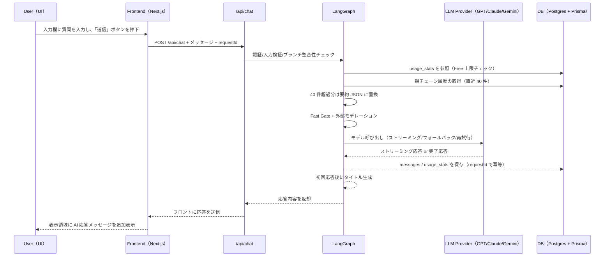
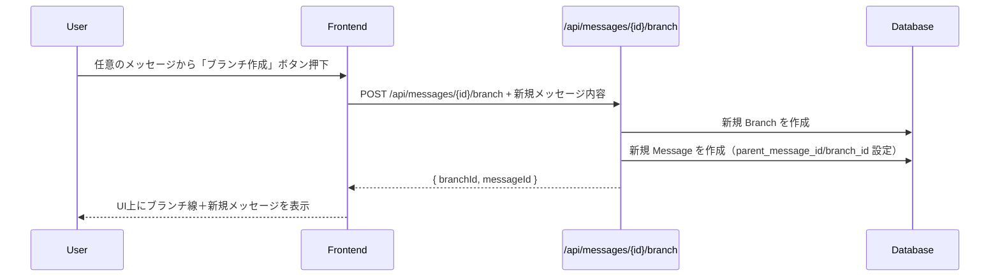
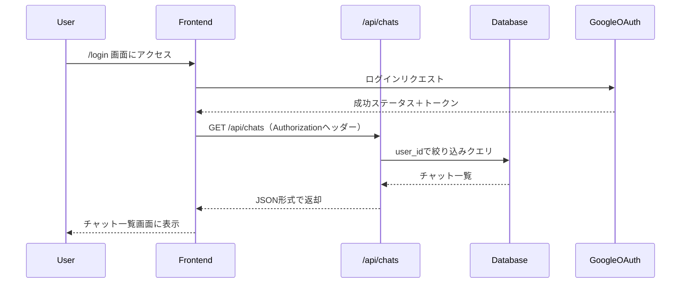
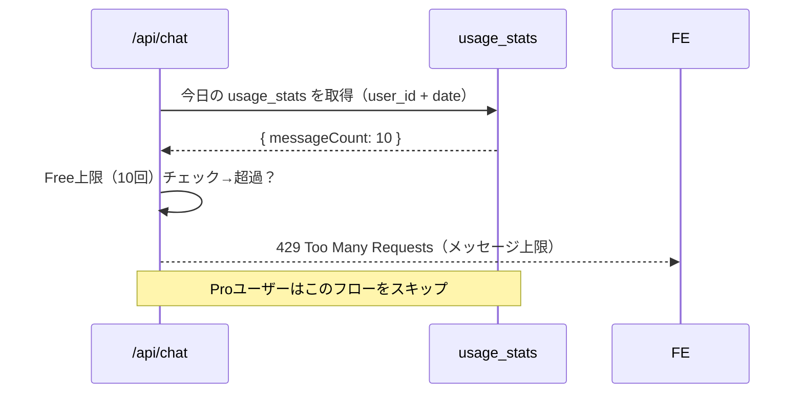

## 📩 1. チャット送信 → 応答生成フロー

---

## 🌿 2. ブランチ作成フロー（既存メッセージから分岐）

---

## 🧭 3. 初回ログイン → チャット取得フロー

---

## 🔐 4. Free プランの利用制限チェックフロー

---

## 📝 備考

-   本フローは MVP 時点での主要処理に着目しています
-   実装時には LangGraph のワークフローノード設計と UI 状態管理を考慮してください
-   今後、以下の拡張フローを追加予定：
    -   モデル切り替え設定フロー
    -   Stripe などの決済処理フロー
    -   共有（Shareable リンク）生成フロー

---

以上。
