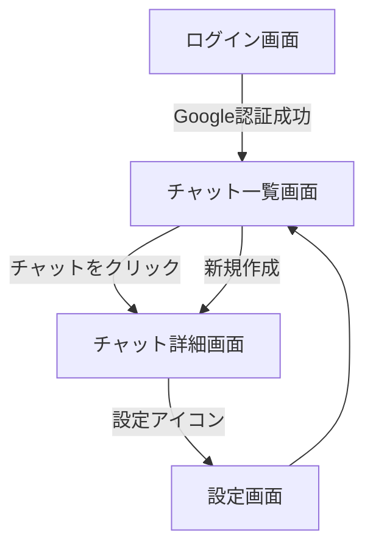

# 画面遷移仕様書（Branch: MVP 版）

本ドキュメントは Branch プロダクトにおける**画面遷移（UI フロー）**を定義します。
MVP 段階で必要な画面間の遷移パターンを明確化します。

---

## 🚦 画面遷移マップ（概要）

---

## 🧭 各画面と遷移詳細

### 1. `/login` ログイン画面

-   Google OAuth ボタンを押下 → 認証成功後 `/chats` へ遷移
-   初回ログインの場合、自動的にユーザー登録される（別画面なし）

---

### 2. `/chats` チャット一覧画面

| 遷移条件                 | 遷移先                                             |
| ------------------------ | -------------------------------------------------- |
| チャット項目をクリック   | `/chats/[id]`                                      |
| 「新しいチャット」ボタン | `/chats/[new]`（内部的に新規作成 → `[id]` へ遷移） |
| 設定アイコンクリック     | `/settings`                                        |

---

### 3. `/chats/[id]` チャット詳細画面

| 遷移条件                   | 遷移先                       |
| -------------------------- | ---------------------------- |
| 設定アイコンを押下         | `/settings`                  |
| ブランチから新チャット作成 | （内部的に更新・同一画面内） |

-   入力フォームで送信 → メッセージが追加される（遷移なし）
-   折りたたみ時は自動生成タイトルのみ表示

---

### 4. `/settings` 設定画面

| 遷移条件                       | 遷移先                 |
| ------------------------------ | ---------------------- |
| 「戻る」リンク or ロゴクリック | `/chats`               |
| モデル変更                     | （保存後）stay on page |

---

## 📝 備考

-   MVP フェーズではオンボーディング画面はなし
-   `/login` と `/chats` 間の認証判定は Next.js API / Middleware で行う
-   ブランチ機能は画面遷移を伴わず、同一画面内で DOM 更新する

---

以上が現在の UI フロー仕様です。
